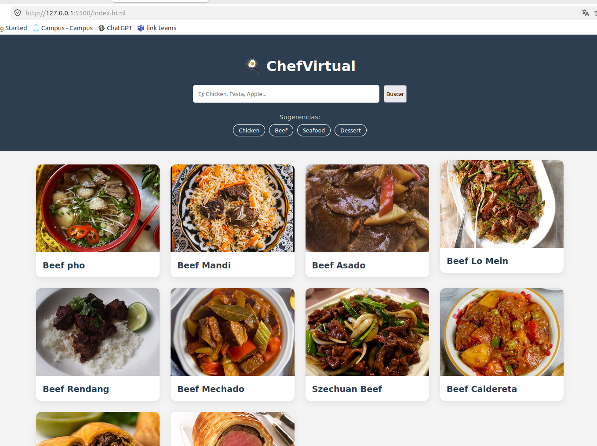
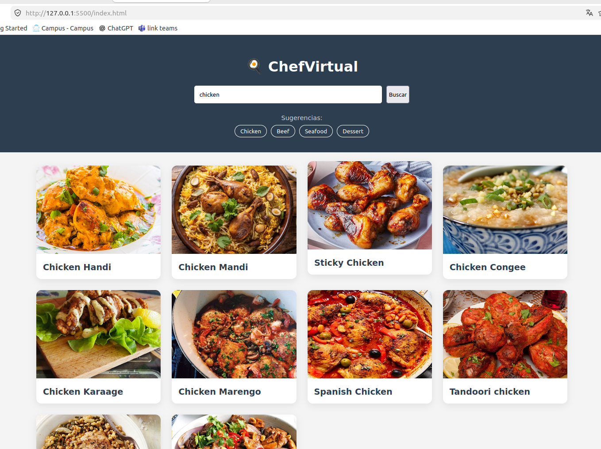
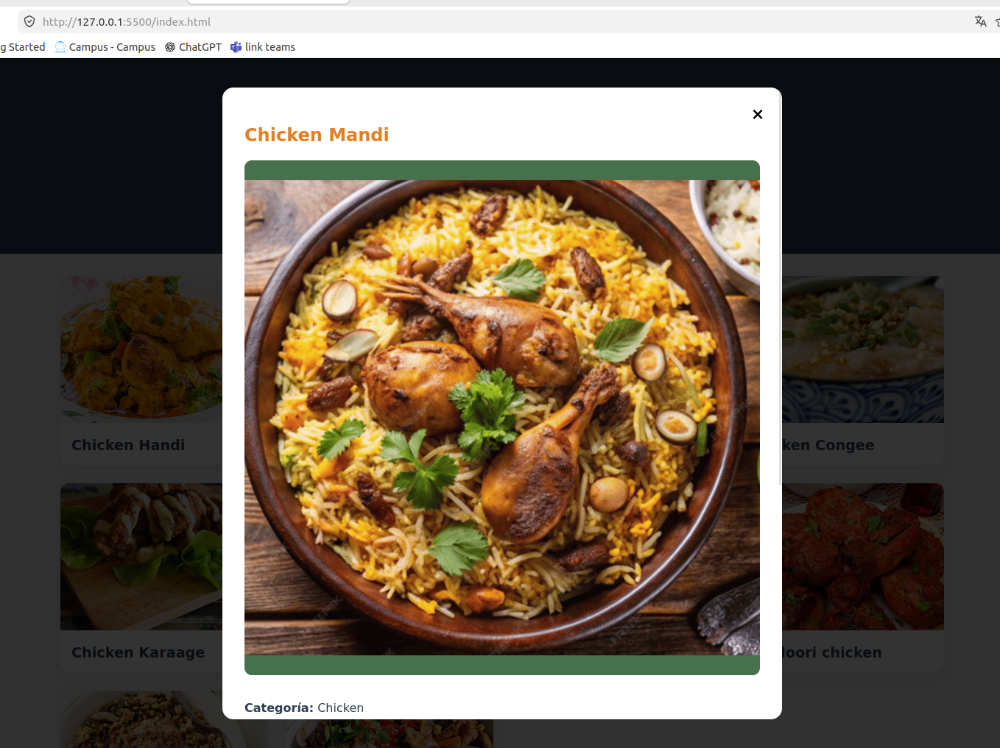
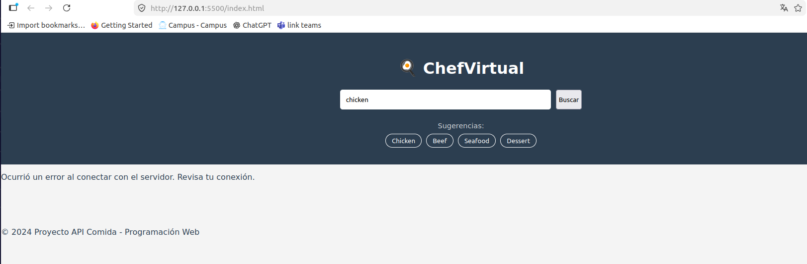

# 📌 Proyecto: Una mini Pagina interactiva usando una API.(JS)
# 👤 Lester Garcia

## 📝 Descripcion:

#### Durante el desarrollo del taller en clase fue posible elaborar una mini página web interactiva utilizando HTML, CSS y JavaScript. El objetivo principal fue aprender a integrar una API de comida para mostrar información dinámica en la página y mejorar la interacción con el usuario.
- 🔗 Este es el enlace de la API que utilice: https://www.themealdb.com/api/json/v1/1/search.php?s

## 🧑‍💻 Tecnologias utilizadas:

-  Visual Studio Code

-  HTML

 -  CSS

-  JavaScript

-  GitHub

 - 

## 📸 Evidencia:

** Esta es la pagina ejecutada desde visualcode.

** En esta seccion se observa un producto en la barra de busqueda y se ve que hay sugerencias a buscar si en dado caso no conoce como hacerlo, la misma página genera opciones y entre ellas hay diez disponibles.

** Aquí se muestra el producto como tal y sus caracteristicas en general dependiendo que producto eligió.

** Esta es una pequeña muestra en que si la API por algun motivo cualquiera ya no es funcional muestra un mensaje la misma pagina. **

## 🚀 Cómo ejecutar el proyecto

1. **Abrir el proyecto en Visual Studio Code**  
   Abre la carpeta donde tienes los archivos del proyecto (`HTML`, `CSS`, `JavaScript`).

2. **Verificar los archivos principales**  
   Asegúrate de tener al menos un archivo `index.html`, junto con tus archivos de estilos y scripts. La ejecucion directa debera ser desde el archivo .html.

3. **Instalar la extensión Live Server (recomendado)**  
   En Visual Studio Code, busca e instala la extensión llamada **Live Server**.
   Si no tambien puedes hacerlo en el navegador pero directamente fuera de visualcode solamente dando click derecho al archivo.html y ejecutarlo con el navegador.

4. **Ejecutar el proyecto con Live Server**  
   Haz clic derecho sobre el archivo `index.html` y selecciona:  
   👉 *"Open with Live Server"*

5. **Abrir la página en el navegador**  
   Se abrirá automáticamente una pestaña en tu navegador mostrando la página web.

6. **Interactuar con la aplicación**  
   Ya como usuario, puedes usar la página (buscar, hacer clic, ver resultados de la API, etc.).

